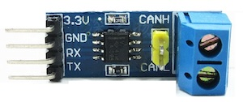
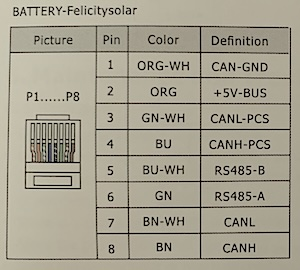
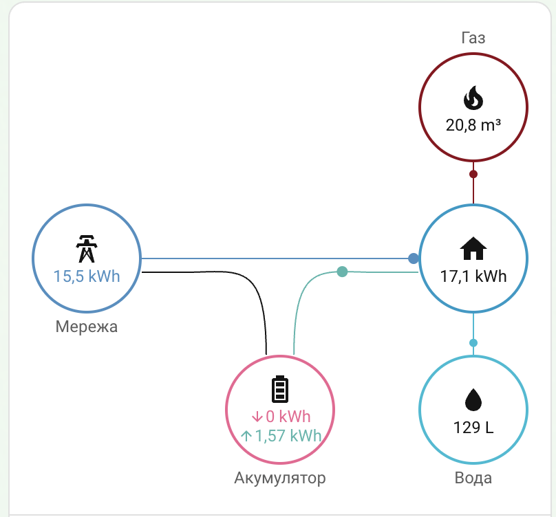
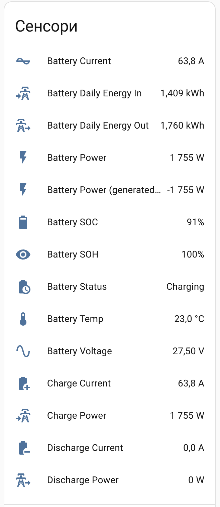
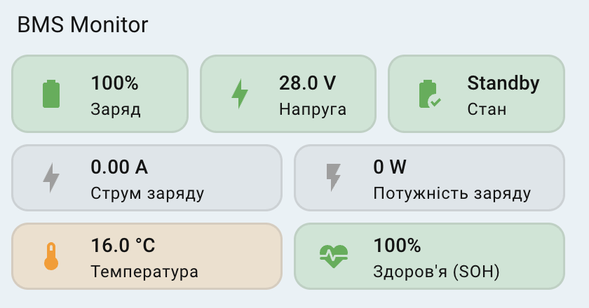
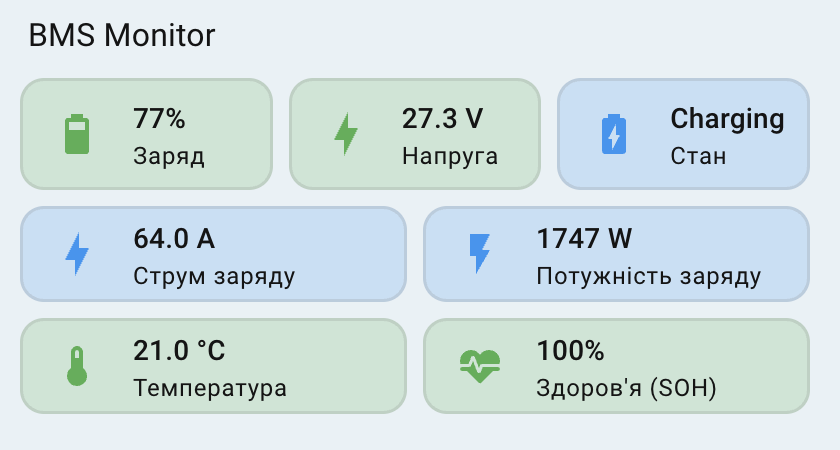

# Felicity Solar BMS to Home Assistant (CAN Bus)


## 📖 Історія проєкту
> [!NOTE]
> *Як то буває, мені трохи не повезло з інвертором - він не інтегрується в Home Assistant та і поки не вдалось подружити його з BMS FelicityESS LiFePO4 (не розбирався чому, але то таке). Також набридло бігати в гараж і моніторити заряд АКБ.*  
> *Хотілося бачити все в Home Assistant, причому з гарними іконками, різною автоматизацією та ішими плюшками які дає Розумний будинок.*  
> *На рішення цього завдання витрачено багато часу, перепробувані всі інтерфейси батареї (в тому числи і RS485) і нарешті вдалось підібрати робочі протоколи, зробити правильні комутації і витягти основні дані батареї.*  
> *Нажаль стан (напругу) кожної банки, реальну ємність та кількість циклів по CAN-шині він не видає, а по 485 взагалі нічого не хотів віддавати. Тому якщо хтось знайде ці дані пишіть, я перевірю і додам до проєкту.*  

## ✨ Результат
Проєкт дозволяє інтегрувати моніторинг BMS літієвих акумуляторів **Felicity Solar** (перевірено на FelicityESS LiFePO4 LPBF24200-A) у Home Assistant за допомогою ESP32 та протоколу CAN.
  
  

## 🛠 Обладнання (Hardware)
Для реалізації проєкту використано:  

| Контролер: ESP32-WROOM-32 DevKit V1 | CAN-трансивер: SN65HVD230 (3.3V) |
| :---: | :---: |
|  |  |
  
Використовуйте провід "кручена пара" (RJ45) для підключення до порту BMS  на батареї.  
  
Розпіновка розʼєма COM на батареї:  
  
> [!WARNING]  
> Для комутації з CAN-трансивером використовуємо піни **1, 3, 4** (НЕ 7, 8 — з них ви дані не отримаєте). Решту невикористовуваних пінів або не обтискайте, або заізолюйте.  

### 🛠 Деталі підключення:
#### 1. З'єднання: АКБ Felicity ↔ CAN-модуль (SN65HVD230)
| Пін АКБ (RJ45) | Назва сигналу | Пін CAN-модуля |
| :--- | :--- | :--- |
| **1** | GND | **GND** |
| **3** | CANL-PCS | **L (CANL)** |
| **4** | CANH-PCS | **H (CANH)** |

#### 2. З'єднання: CAN-модуль ↔ ESP32-WROOM-32
| Пін CAN-модуля | Пін ESP32 | Примітка |
| :--- | :--- | :--- |
| **3.3V** | 3V3 | Живлення |
| **GND** | GND | Спільна земля |
| **RX** | GPIO 16 (RX2) | Прийом даних |
| **TX** | GPIO 17 (TX2) | Передача даних |  

---

## 🎨 Код yaml для прошивки ESP  
  
Вважається що ви вмієте прошивати ESP32, тому не буду пояснювати як це робиться. Після вдалої прошивки в Пристроях побачите свою ESP з усіма доступними сутностями, про них розповідаю нижче.  

<details>
  <summary>▶ Натисніть тут, щоб переглянути повний код конфігурації з коментарями</summary>
  
```yaml

# Основні налаштування проєкту
esphome:
  name: "bms-monitor"
  friendly_name: BMS Monitor Felicity
  min_version: 2025.11.0
  name_add_mac_suffix: false

# Конфігурація мікроконтролера
esp32:
  board: esp32dev
  framework:
    type: arduino

# Логування (вивід діагностики в консоль)
logger:
  level: INFO

# Зв'язок з Home Assistant
api:

# Дистанційне оновлення прошивки
ota:
- platform: esphome

# Налаштування Wi-Fi (дані беруться з файлу secrets.yaml)
wifi:
  ssid: !secret wifi_ssid
  password: !secret wifi_password

# Синхронізація часу з Home Assistant
time:
  - platform: homeassistant
    id: homeassistant_time

# Налаштування CAN-шини для спілкування з BMS
canbus:
  - platform: esp32_can
    id: bms_can
    can_id: 0x100
    tx_pin: GPIO17
    rx_pin: GPIO16
    bit_rate: 500kbps # Швидкість шини 500 кбіт/с
    mode: NORMAL
    on_frame:
      # Пакет 0x351: Обробка стану здоров'я акумулятора (SOH)
      - can_id: 0x351
        then:
          - lambda: |-
              // Читання 4 та 5 байтів, множення на 0.1 для отримання відсотків
              float val = (uint16_t)(x[5] << 8 | x[4]) * 0.1;
              if (val <= 100) id(battery_soh).publish_state(val);

      # Пакет 0x355: Обробка рівня заряду (SOC)
      - can_id: 0x355
        then:
          - lambda: |-
              // Читання 0 та 1 байтів для отримання % заряду
              float val = (uint16_t)(x[1] << 8 | x[0]);
              if (val <= 100) id(battery_soc).publish_state(round(val));

      # Пакет 0x356: Напруга, Струм, Температура та розрахунок Потужності
      - can_id: 0x356
        then:
          - lambda: |-
              // Декодування даних з пакету
              float v = (uint16_t)(x[1] << 8 | x[0]) * 0.01; // Напруга (V)
              float c = (int16_t)(x[3] << 8 | x[2]) * 0.1;   // Струм (A)
              float t = (int16_t)(x[5] << 8 | x[4]) * 0.1;   // Температура (°C)
              float p = v * c;                               // Розрахунок Ватт (P = U * I)

              // Публікація базових значень
              id(battery_voltage).publish_state(v);
              id(battery_current).publish_state(c);
              id(battery_temp).publish_state(t);
              id(battery_power).publish_state(p);

              // Логіка розділення на Заряд/Розряд з урахуванням "шуму" (1.8A)
              // Це допомагає уникнути постійного перемикання при мізерних токах
              if (c > 1.8) {
                // Стан: Заряджання
                id(charge_current).publish_state(c);
                id(discharge_current).publish_state(0);
                id(charge_power).publish_state(p);
                id(discharge_power).publish_state(0);
                id(battery_status).publish_state("Charging");
              } else if (c < -1.8) {
                // Стан: Розряджання (використовуємо fabs для позитивних значень у сенсорах)
                id(charge_current).publish_state(0);
                id(discharge_current).publish_state(fabs(c));
                id(charge_power).publish_state(0);
                id(discharge_power).publish_state(fabs(p));
                id(battery_status).publish_state("Discharging");
              } else {
                // Стан: Спокій або дуже мале навантаження
                id(charge_current).publish_state(0);
                id(discharge_current).publish_state(0);
                id(charge_power).publish_state(0);
                id(discharge_power).publish_state(0);
                id(battery_status).publish_state("Idle/Standby");
              }

# Визначення віртуальних сенсорів для Home Assistant
sensor:
  # Електричні параметри
  - platform: template
    name: "Battery Voltage"
    id: battery_voltage
    unit_of_measurement: "V"
    accuracy_decimals: 2
    device_class: voltage
    state_class: measurement

  - platform: template
    name: "Battery Current"
    id: battery_current
    unit_of_measurement: "A"
    accuracy_decimals: 1
    device_class: current
    state_class: measurement

  - platform: template
    name: "Battery Power"
    id: battery_power
    unit_of_measurement: "W"
    accuracy_decimals: 0
    device_class: power
    state_class: measurement

  # Сенсори для енергопанелі (окремо вхід та вихід)
  - platform: template
    name: "Charge Current"
    id: charge_current
    unit_of_measurement: "A"
    accuracy_decimals: 1
    device_class: current
    state_class: measurement
    icon: "mdi:battery-plus"

  - platform: template
    name: "Charge Power"
    id: charge_power
    unit_of_measurement: "W"
    accuracy_decimals: 0
    device_class: power
    state_class: measurement
    icon: "mdi:transmission-tower-import"

  - platform: template
    name: "Discharge Current"
    id: discharge_current
    unit_of_measurement: "A"
    accuracy_decimals: 1
    device_class: current
    state_class: measurement
    icon: "mdi:battery-minus"

  - platform: template
    name: "Discharge Power"
    id: discharge_power
    unit_of_measurement: "W"
    accuracy_decimals: 0
    device_class: power
    state_class: measurement
    icon: "mdi:transmission-tower-export"

  # Стан акумулятора
  - platform: template
    name: "Battery SOC"
    id: battery_soc
    unit_of_measurement: "%"
    accuracy_decimals: 0
    device_class: battery
    state_class: measurement

  - platform: template
    name: "Battery Temp"
    id: battery_temp
    unit_of_measurement: "°C"
    accuracy_decimals: 1
    device_class: temperature
    state_class: measurement

  - platform: template
    name: "Battery SOH"
    id: battery_soh
    unit_of_measurement: "%"
    accuracy_decimals: 0
    state_class: measurement

  # Розрахунок добової енергії (кВт·год) для статистики
  - platform: total_daily_energy
    name: "Battery Daily Energy In"
    id: battery_daily_energy_in
    power_id: charge_power
    unit_of_measurement: "kWh"
    accuracy_decimals: 3
    device_class: energy
    state_class: total_increasing
    filters:
      - multiply: 0.001 # Конвертація Вт у кВт

  - platform: total_daily_energy
    name: "Battery Daily Energy Out"
    id: battery_daily_energy_out
    power_id: discharge_power
    unit_of_measurement: "kWh"
    accuracy_decimals: 3
    device_class: energy
    state_class: total_increasing
    filters:
      - multiply: 0.001 # Конвертація Вт у кВт

# Текстовий сенсор для відображення режиму роботи словами
text_sensor:
  - platform: template
    name: "Battery Status"
    id: battery_status
    icon: "mdi:battery-clock"

```
</details>  

---

### 📊 Показники системи (Sensors)

Нижче наведено перелік даних, які зчитуються з BMS Felicity через CAN-шину:

#### Електричні параметри:
* ⚡ **Battery Voltage:** 27.30 V
* 🔌 **Battery Current:** 0.1 A - повний показник
* 🔋 **Battery Power:** 3 W - повний показник
* 🔌 **Charge Current:** 0.0 A - фільтрований (відсічені мікроколивання)
* ⚡ **Charge Power:** 0 W - фільтрований (відсічені мікроколивання)
* 🔌 **Discharge Current:** 0.0 A - фільтрований (відсічені мікроколивання)
* 🔋 **Discharge Power:** 0 W - фільтрований (відсічені мікроколивання)

#### Стан та здоров'я:
* 📈 **Battery SOC:** 100%
* 💓 **Battery SOH:** 100%
* ℹ️ **Battery Status:** Idle/Standby
* 🌡️ **Battery Temp:** 16.0 °C

#### Статистика енергії:
* 📥 **Battery Daily Energy In:** 0.000 kWh - не рахує при мікроколиваннях струму
* 📤 **Battery Daily Energy Out:** 0.000 kWh - не рахує при мікроколиваннях струму

## 📺 Підключення в Home Assistant на Енергетичній панелі  
  
  

Щоб на енергетичній панелі виводились данні по вашому АКБ її треба там підключити.  
Для цього перейдіть в режим редагування Енергетичної панелі, в блоці "Аккумуляторна батарея" натисність "Додати акумуляторну систему", зʼявиться вікно для заповення-підключення данних АКБ. У випадаючих списках підключіть сутності сенсора "Battery Daily Energy In" та сенсора "Battery Daily Energy Out".  
Нижче виберіть режим "Power sensor type" -> "Two sensors". Зʼявляться два поля, додайте в них сенсори потужності Розряджання - "Discharge Power" і потужності Заряджання - "Charge Power". Натисніть "Зберегти".  
> [!WARNING]
>У списку Сенсорів вашого пристроя-монітора НА автоматично створить свій сенсор "Battery Power" - не видаляйте його, а просто перейменуйте його назву щоб не було два однакових, бо там поруч буде і ваш такий же сенсор але у нього інше призначення і налаштування (наприклад, "Battery Power (generated HA)"), бо саме його НА буде використовувати для всієї статистики в Енергопанелі.  
> Цей сенсор зʼявиться там не одразу, а тільки після першої розрядки-зарядки.

Загалом перелік всіх сенсорів буде таким:  



## 📺 Візуалізація в Home Assistant  

Візуалізація карток це вже сугубо індивідуальне, головне мати всі данні, а вони в нас вже є. Тут просто поділюсь своїм оформленням, як сподобається то беріть і собі.  
Моя картка викристовує моди - card-mod, Mushroom. Вони додають динамічності та гнучкий стиль оформлення.  
Фонова кольорова підсвітка привʼязана до заданих порогів значень тому буде міняти колір при досягнені того чи іншого порогу. Це можете побачити в коді картки і змінити їх по своєму бажанню та потребам.  
  
   

#### Код yaml картки  
Код картки надаю як є, тому щоб вона працювала у вас обовʼязково замініть назви сутностей в коді на свої. Також рекомендую правити її вміст через редактор yaml, а не візуальним редактором.  

<details>
  <summary>▶ Натисніть тут, щоб переглянути повний код картки</summary>
  
```yaml

type: vertical-stack
cards:
  # Перший ряд: Основні показники (Заряд, Напруга, Стан)
  - type: grid
    columns: 3
    square: false
    cards:
      # Картка заряду акумулятора (SOC)
      - type: custom:mushroom-template-card
        entity: sensor.bms_felicity_battery_soc
        primary: "{{ states(entity) | int(0) }}%"
        secondary: Заряд
        # Динамічна іконка: змінюється кожні 10% заряду
        icon: >
            mdi:battery
           mdi:battery-{{ (pct / 10) | int }}0 
          mdi:battery-outline 
        # Колір іконки: зелений (>30%), помаранчевий (20-30%), червоний (<20%)
        color: >
            green  orange  red 
        features_position: bottom
        card_mod:
          style: >
            ha-card {
              border: 1.5px solid rgba(128, 128, 128, 0.2) !important;
              height: 56px !important;
              display: flex !important;
              flex-direction: column !important;
              justify-content: center !important;
              align-items: flex-start !important;
              padding-left: 0px !important;
              /* Динамічний фон картки відповідно до рівня заряду */
              
              
                background: #E8F5E9 !important;
              
                background: #FFF3E0 !important;
              
                background: #FFEBEE !important;
              
            } mushroom-state-item { margin: 0px !important; padding: 0px
            !important; } :host { 
              --mush-icon-size: 30px !important; 
              --title-font-size: 18px !important; 
              --secondary-font-size: 10px; 
              --title-font-weight: 700;
              --mush-spacing: 0px !important;
            }

      # Картка напруги акумулятора
      - type: custom:mushroom-template-card
        entity: sensor.bms_felicity_battery_voltage
        primary: "{{ states(entity) | float(0) | round(2) }} V"
        secondary: Напруга
        icon: mdi:lightning-bolt
        # Колірна індикація напруги (поріг 26V та 25V)
        icon_color: >
            green  orange  red 
        card_mod:
          style: >
            ha-card {
              border: 1.5px solid rgba(128, 128, 128, 0.2) !important;
              height: 56px !important;
              display: flex !important;
              flex-direction: column !important;
              justify-content: center !important;
              align-items: flex-start !important;
              padding-left: 0px !important;
              /* Візуалізація фону залежно від вольтажу */
              
              
                background: #E8F5E9 !important;
              
                background: #FFF3E0 !important;
              
                background: #FFEBEE !important;
              
            } mushroom-state-item { margin: 0px !important; padding: 0px
            !important; } :host { 
              --mush-icon-size: 30px !important; 
              --title-font-size: 16px !important; 
              --secondary-font-size: 10px;
              --title-font-weight: 700;
              --mush-spacing: 0px !important;
            }

      # Картка статусу (Зарядка/Розрядка/Очікування)
      - type: custom:mushroom-template-card
        entity: sensor.bms_felicity_battery_status
        primary: >
              
            Standby  
            
            {{ status[0:8] }}  
          
        secondary: Стан
        # Зміна іконок під конкретний процес
        icon: >
            
          mdi:battery-minus   mdi:battery-charging   mdi:battery-check  
          mdi:battery-outline 
        icon_color: >
            
          orange   blue   green   grey 
        card_mod:
          style: >
            ha-card {
              border: 1.5px solid rgba(128, 128, 128, 0.2) !important;
              height: 56px !important;
              display: flex !important;
              flex-direction: column !important;
              justify-content: center !important;
              align-items: flex-start !important;
              padding-left: 0px !important;
              /* Колір фону: помаранчевий для розряду, синій для заряду */
              
              
                background: #FFF3E0 !important;
              
                background: #E3F2FD !important;
              
                background: #E8F5E9 !important;
              
                background: #F5F5F5 !important;
              
            } mushroom-state-item { margin: 0px !important; padding: 0px
            !important; } :host { 
              --mush-icon-size: 30px !important; 
              --title-font-size: 12px; 
              --secondary-font-size: 10px; 
              --mush-spacing: 0px !important;
            }

  # Другий ряд: Поточні показники (Струм та Потужність)
  - type: grid
    columns: 2
    square: false
    cards:
      # Картка сили струму (Ампери)
      - type: custom:mushroom-template-card
        entity: sensor.bms_felicity_battery_status
        tap_action:
          action: more-info
          entity: sensor.bms_felicity_battery_current # Покаже графік струму
        primary: |
          
          
            {{ states('sensor.bms_felicity_discharge_current') | float(0) | round(2) }} A
          
            {{ states('sensor.bms_felicity_charge_current') | float(0) | round(2) }} A
          
            0.00 A
          
        secondary: >
           {{ 'Струм розряду' if s ==
          'discharging' else 'Струм заряду' }}
        icon: mdi:lightning-bolt
        icon_color: >
             blue 
             red
             orange
             green 
           grey 
        card_mod:
          style: >
            ha-card {
              border: 1.5px solid rgba(128, 128, 128, 0.2) !important;
              height: 48px !important;
              display: flex !important;
              flex-direction: column !important;
              justify-content: center !important;
              align-items: flex-start !important;
              padding-left: 0px !important;
              /* Фон стає червоним при великому струмі розряду (>40A) */
              
              
              
                background: #E3F2FD !important;
              
                 background: #FFEBEE !important;
                 background: #FFF3E0 !important;
                 background: #E8F5E9 !important; 
              
                background: #F5F5F5 !important;
              
            } mushroom-state-item { margin: 0px !important; padding: 0px
            !important; } :host { 
              --mush-icon-size: 26px !important; 
              --title-font-size: 13px; 
              --secondary-font-size: 9px; 
              --mush-spacing: 0px !important;
            }

      # Картка потужності (Вати)
      - type: custom:mushroom-template-card
        entity: sensor.bms_felicity_battery_status
        tap_action:
          action: more-info
          entity: sensor.bms_felicity_battery_power # Покаже графік потужності
        primary: |
          
          
            {{ states('sensor.bms_felicity_discharge_power') | float(0) | round(0) }} W
          
            {{ states('sensor.bms_felicity_charge_power') | float(0) | round(0) }} W
          
            0 W
          
        secondary: >
           {{ 'Потужність розряду' if s ==
          'discharging' else 'Потужність заряду' }}
        icon: mdi:flash
        icon_color: >
             blue 
             red
             orange
             green 
           grey 
        card_mod:
          style: >
            ha-card {
              border: 1.5px solid rgba(128, 128, 128, 0.2) !important;
              height: 48px !important;
              display: flex !important;
              flex-direction: column !important;
              justify-content: center !important;
              align-items: flex-start !important;
              padding-left: 0px !important;
              /* Колірна індикація критичного навантаження (>1200W) */
              
              
              
                background: #E3F2FD !important;
              
                 background: #FFEBEE !important;
                 background: #FFF3E0 !important;
                 background: #E8F5E9 !important; 
              
                background: #F5F5F5 !important;
              
            } mushroom-state-item { margin: 0px !important; padding: 0px
            !important; } :host { 
              --mush-icon-size: 26px !important; 
              --title-font-size: 13px; 
              --secondary-font-size: 9px; 
              --mush-spacing: 0px !important;
            }

  # Третій ряд: Технічний стан (Температура та Здоров'я)
  - type: grid
    columns: 2
    square: false
    cards:
      # Картка температури акумулятора
      - type: custom:mushroom-template-card
        entity: sensor.bms_felicity_battery_temp
        primary: "{{ states(entity) }} °C"
        secondary: Температура
        icon: mdi:thermometer
        icon_color: >
           
          green  orange  red 
        card_mod:
          style: >
            ha-card {
              border: 1.5px solid rgba(128, 128, 128, 0.2) !important;
              height: 48px !important;
              display: flex !important;
              flex-direction: column !important;
              justify-content: center !important;
              align-items: flex-start !important;
              padding-left: 0px !important;
              /* Контроль оптимального температурного діапазону (20-30°C) */
              
              
                background: #E8F5E9 !important;
              
                background: #FFF3E0 !important;
              
                background: #FFEBEE !important;
              
            } mushroom-state-item { margin: 0px !important; padding: 0px
            !important; } :host { 
              --mush-icon-size: 26px !important; 
              --title-font-size: 13px; 
              --secondary-font-size: 9px; 
              --mush-spacing: 0px !important;
            }

      # Картка стану здоров'я акумулятора (SOH)
      - type: custom:mushroom-template-card
        entity: sensor.bms_felicity_battery_soh
        primary: "{{ states(entity) | int(0) }}%"
        secondary: Здоров'я (SOH)
        icon: mdi:heart-pulse
        icon_color: >
            green  orange  red 
        card_mod:
          style: >
            ha-card {
              border: 1.5px solid rgba(128, 128, 128, 0.2) !important;
              height: 48px !important;
              display: flex !important;
              flex-direction: column !important;
              justify-content: center !important;
              align-items: flex-start !important;
              padding-left: 0px !important;
              /* Візуалізація деградації акумулятора */
              
              
                background: #E8F5E9 !important;
              
                background: #FFF3E0 !important;
              
                background: #FFEBEE !important;
              
            } mushroom-state-item { margin: 0px !important; padding: 0px
            !important; } :host { 
              --mush-icon-size: 26px !important; 
              --title-font-size: 13px; 
              --secondary-font-size: 9px; 
              --mush-spacing: 0px !important;
            }
  
```
</details>  

  
## 📊 Візуалізація та пороги (Thresholds)

Інтерфейс Dashboard побудований на базі [Mushroom](https://github.com/piitaya/lovelace-mushroom) та [Card Mod](https://github.com/thomasloven/lovelace-card-mod). Система використовує динамічну зміну кольорів іконок та фону карток для миттєвого моніторингу стану системи.  
Це мої вподобання по таких порогах зміни кольорів, ви ж можете змінити їх в коді картки на свої вподобання.

### 🔋 Основні показники акумулятора

| Параметр | 🟢 Зелений (OK) | 🟠 Помаранчевий (Увага) | 🔴 Червоний (Критично) |
| :--- | :--- | :--- | :--- |
| **Рівень заряду (SOC)** | `> 30%` | `20% - 30%` | `< 20%` |
| **Напруга (Voltage)** | `>= 26.0V` | `25.0V - 25.9V` | `< 25.0V` |
| **Здоров'я (SOH)** | `>= 90%` | `70% - 89%` | `< 70%` |

> **Примітка:** Іконка заряду динамічно змінюється кожні 10% (mdi:battery-10, 20...90).

---

### ⚡ Режими роботи та потоки енергії

Колір картки та іконки автоматично змінюється залежно від активного процесу:

* **🔵 Синій (Charging):** Йде процес заряджання акумулятора.
* **🟢/🟠/🔴 (Discharging):** Акумулятор живить систему. Колір залежить від навантаження.
* **⚪ Сірий (Standby):** Струм менше порогового значення (1.8A), система в стані спокою.

#### Пороги навантаження при розряді:
| Стан | Струм (A) | Потужність (W) | Колір індикації |
| :--- | :--- | :--- | :--- |
| **Норма** | `< 30A` | `< 1000W` | 🟢 Зелений |
| **Високе навантаження** | `30A - 40A` | `1000W - 1200W` | 🟠 Помаранчевий |
| **Перевантаження** | `> 40A` | `> 1200W` | 🔴 Червоний |

---

### 🌡️ Температурний режим

Система відстежує температуру комірок для забезпечення тривалого терміну служби:

| Температура | Колір | Статус |
| :--- | :--- | :--- |
| `20°C - 30°C` | 🟢 Зелений | Оптимально |
| `10°C - 20°C` / `30°C - 40°C` | 🟠 Помаранчевий | Допустимо |
| `< 10°C` або `> 40°C` | 🔴 Червоний | Ризик деградації |

---

### 🛠️ Технічні особливості реалізації
* **Card Mod:** Використовується для створення напівпрозорого фону карток `rgba(..., 0.2)`. Це дозволяє бачити статус боковим зором, не вчитуючись у цифри.
* **Deadband (Мертва зона):** В прошивці встановлено поріг **1.8A**. Якщо струм менший за це значення, система ігнорує дрібні коливання і відображає статус `Standby`, що запобігає "миготінню" кольорів інтерфейсу.
  
#### 🧩 Необхідні компоненти
Як я вже писав вище для коректної роботи інтерфейсу моєї картки переконайтеся, що у вас встановлені наступні плагіни через **HACS**:
* [Mushroom](https://github.com/piitaya/lovelace-mushroom)
* [Card-mod](https://github.com/thomasloven/lovelace-card-mod) (для динамічного фону та стилізації)

  
#### 🧩 Корпус для плат  

Для своїх esp-плат і додаткових модулів я використовую надруковані на 3Д принтері корпуси одного виду, вони універсальні по розміру і туди влазить багато модулів, але без кріплень в середені тому не пропоную свій варіант. Раджу скористатись готовими рішеннями якщо не вмієте як і я робити 3Д моделі. Ось посилання на спільноту де можете вибрати готову 3Д модель яка вам сподобається і роздрукувати: [www.thingiverse.com](https://www.thingiverse.com/search?q=esp+box&page=1)  

> [!CAUTION]
> **ВІДМОВА ВІД ВІДПОВІДАЛЬНОСТІ:** Ви використовуєте цей код та схеми на свій власний ризик. Я не несу відповідальності за будь-які пошкодження вашого обладнання (BMS, ESP32 або інвертора). Будьте уважні з полярністю та напругою!
  
---
### ☕ Підтримка проекту
Якщо цей проєкт став вам у пригоді, ви можете пригостити автора кавою:
[**🇺🇦 Підтримати через Monobank**](https://send.monobank.ua/jar/9gHSGKWi19)  
